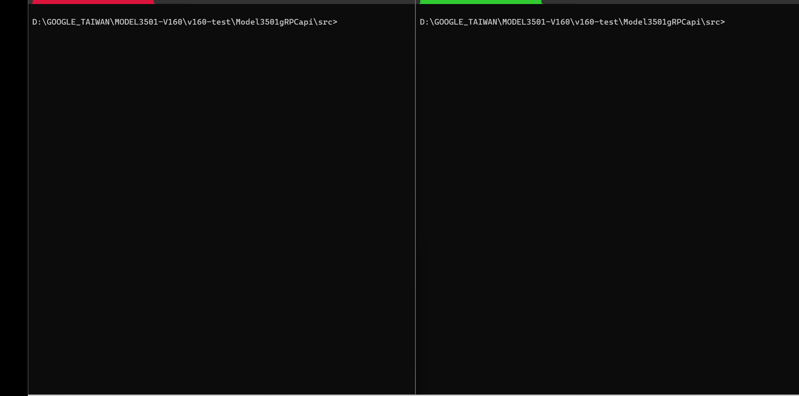

# Model3501Grpcapi

This repository serves as a comprehensive source code for Model3501Grpcapi, which facilitates communication between client and server models using gRPC (Google Remote Procedure Call)

## gRPC – An RPC library and framework

gRPC is a modern, open source, high-performance remote procedure call (RPC) framework that can run anywhere. gRPC enables client and server applications to communicate transparently, and simplifies the building of connected systems.

## Prerequisites for running or building

### Install Python 3.8 and above (if not already installed)

Install python package from [python.org](https://www.python.org/ftp/python/3.8.0/python-3.8.0-amd64.exe)

```shell
Note: Install python version above 3.8
```

### Install/upgrade pip

```shell
pip --version
python -m pip install --upgrade pip
```

### Install python packages

Use the following steps to install the required libraries:

1. Open a command prompt or terminal.
2. Run the following commands to install the python dependency libraries:

* pyusb  - 1.2.1
* grpcio - 1.60.1
* protobuf - 4.25.3
* grpcio-tools - 1.60.1

```shell
pip install pyusb
pip install grpcio
pip install protobuf
```

## Installing Import Libraries

1. Clone the repository ```git clone https://github.com/mcci-usb/Model3501gRPCapi.git```

2. Open a `cmd prompt` and change directory to  `{path_to_repository}/Model3501gRPCapi`. using `cd` into the root directory.

## Run Server

To run the server script, execute the following command in your terminal:

```shell
python model3501_server.py <port_number>
```

Replace <port_number> with the desired port number where the server should listen for incoming connections.

## Run Client

To run the client script, execute the following command in your terminal:

```shell
python model3501_client.py <server_ip> <port_number> <cmd> <value>
```

```shell
Note: Here both server.py and client.py run into difftrent machines.

```

Replace `server_ip` with the IP address of the server, `port_number` with the port number where the server is listening for incoming connections, `cmd` with the desired command, and `value` with the corresponding value for the command.

```shell
Note: The server and client run on different machines.
```

## cmd line arguments to Server

* argument 1: `model3501_server.py`
* argument 2: `port_number`

**NOTE:**

* example of port_number

```shell
python model3501_server.py 2023
```

## cmd line arguments to Client

* argument 1: `model3501_client.py`
* argument 2: `server_ip_address`
* argument 3: `server_port_number`
* argument 4: `action`
* argument 5: `value`

**NOTE:**

```shell
python model3501_client.py 192.168.x.xx 2023 -h

python model3501_client.py 192.168.x.xx 2023 list

python model3501_client.py 192.168.x.xx 2023 set_speed s #(set super speed)

python model3501_client.py 192.168.x.xx 2023 set_speed h #(set high speed)

python client.py 192.168.x.xx 2023 emulateCharger 15
# (Emulate a PD charger with max watts 'W')
# 15W (5V 3.0A)
# 27W (9V 3.0A)
# 45W (15V 3.0A)

python model3501_client.py 192.168.x.xx 2023 cd_stress_on
# Enable connect disconnect stress

python model3501_client.py 192.168.x.xx 2023 cd_stress_off
# Disable connect disconnect stress

python model3501_client.py 192.168.x.xx 2023 prswap
# Initiate power role swap

python model3501_client.py 192.168.x.xx 2023 drswap
# Initiate data role swap

python model3501_client.py 192.168.x.xx 2023 pdcaptivecable
# Switch PD to captive cable

python model3501_client.py 192.168.x.xx 2023 pdchargerport
# Switch PD to charger receptacle

python model3501_client.py 192.168.x.xx 2023 get_power_role
# Read the current power role

python model3501_client.py 192.168.x.xx 2023 get_rdo
# Read the RDO for the current power contract

python model3501_client.py 192.168.x.xx 2023 reconnect --delay_reconnect <delay_ms> --delay_disconnect <delay_ms>


python model3501_client.py 192.168.x.xx 2023 vconnswap
#Initiate Vconn swap
```

## Model3501gRPC Preview


## Demo Video (Server)


## Demo Video (Client)


## Demo Video (both server and client Run in Single machine)


